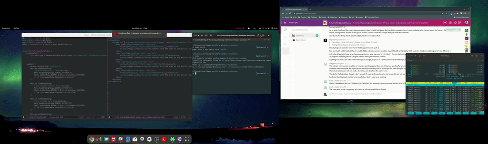

# Window Swapper Extension

Swap all windows on the current monitor with windows from the monitor {Left, Right, Up, Down}.

Default keybindings to `<Ctrl><Super><Shift>-Direction` -- configurable via gsettings at `org.gnome.shell.extensions.window-swapper.swap-windows-{left,right,up,to}`

